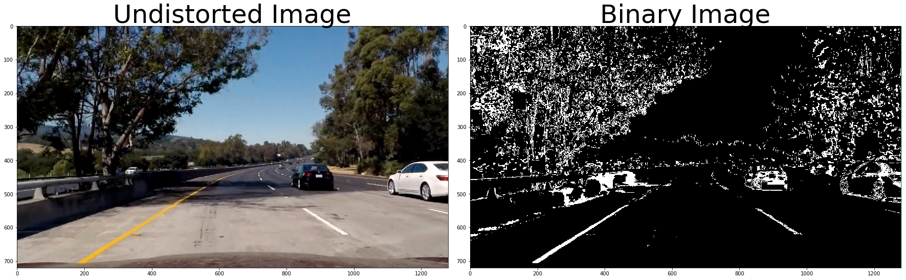
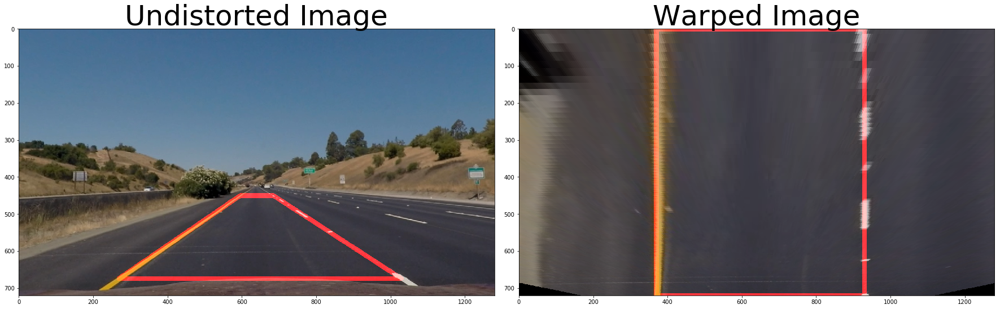
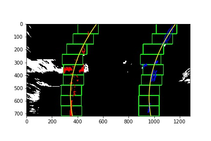
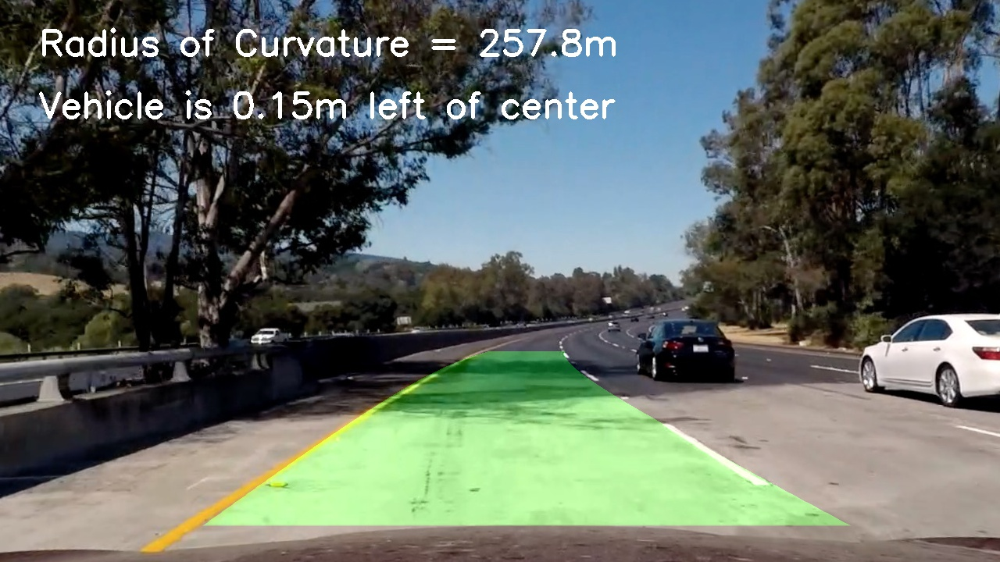

# Advanced Lane Finding Project
**Liang Zhang**

The goals / steps of this project are the following:

* Compute the camera calibration matrix and distortion coefficients given a set of chessboard images.
* Apply a distortion correction to raw images.
* Use color transforms, gradients, etc., to create a thresholded binary image.
* Apply a perspective transform to rectify binary image ("birds-eye view").
* Detect lane pixels and fit to find the lane boundary.
* Determine the curvature of the lane and vehicle position with respect to center.
* Warp the detected lane boundaries back onto the original image.
* Output visual display of the lane boundaries and numerical estimation of lane curvature and vehicle position.

## [Rubric](https://review.udacity.com/#!/rubrics/571/view) Points

Here I will consider the rubric points individually and describe how I addressed each point in my implementation.  

### Camera Calibration

#### 1. Prepare object points and image points 
The code for this step is contained in the first code cell of the IPython notebook located in "./extract_lane_lines.ipynb".

I start by preparing "object points", which will be the (x, y, z) coordinates of the chessboard corners in the world. Here I am assuming the chessboard is fixed on the (x, y) plane at z=0, such that the object points are the same for each calibration image.  Thus, `objp` is just a replicated array of coordinates, and `objpoints` will be appended with a copy of it every time I successfully detect all chessboard corners in a test image.  `imgpoints` will be appended with the (x, y) pixel position of each of the corners in the image plane with each successful chessboard detection.  

### 2. An example of a distortion corrected calibration image.

I then used the output `objpoints` and `imgpoints` to compute the camera calibration and distortion coefficients using the `cv2.calibrateCamera()` function.  I applied this distortion correction to the test image "./camera_cal/calibration2.jpg" using the `cv2.undistort()` function and obtained this result: 

![Image undistortion][./output_images/example_undistort.png]

### Pipeline (single images)

#### 1. An example of a distortion-corrected image.

I read in the test image "./camera_cal/calibration2.jpg" and used the cal_undistort( , , ) function. Then I obtained the following result:

#### 2. Use color transforms and gradients to create a thresholded binary image. 

I used a combination of color and gradient thresholds to generate a binary image ( binarizer function in the fourth code cell in "./extract_lane_lines.ipynb"). For the color threshold, I applied to the s channel of the HLS color space, and for the gradient, I took the x derivative.

Here's an example of my output for this step.  

#### 3. Perspective transform 
The code for my perspective transform includes a function called `warper()`, which appears in the fourth code cell in "./extract_lane_lines.ipynb". The `warper()` function takes as inputs an image (`img`), as well as source (`src`) and destination (`dst`) points.  I chose to  hardcode the source and destination points.

This resulted in the following source and destination points:

| Source        | Destination   | 
|:-------------:|:-------------:| 
| 595, 450      | 369, 0        | 
| 685, 450      | 929, 0      |
| 269, 674     | 369, 720      |
| 1029, 674      | 929, 720        |

I verified that my perspective transform was working as expected by drawing the `src` and `dst` points onto a test image and its warped counterpart to verify that the lines appear parallel in the warped image.

#### 4. Identify lane-line pixels and fit their positions with a polynomials.

I identified the lane-line pixels by using the basic implemention of the sliding search windows. Then I fit the lane positions with second order polynomials. After the first frame, I used the lane positions from previous frame to search the lane lines. Here is an example of my result:

#### 5. Calculate the radius of curvature of the lane and the position of the vehicle with respect to center.

I did this in the 9th code cell of my IPython notebook.

#### 6. An example image of the results plotted back down onto the road.

I implemented this step in the 10th code cell in my IPython notebook.  Here is an example of my result on a test image:

### Pipeline (video)

I rearranged the code I mentioned above and put them together in a function process_image() located in the 12th code cell in my IPython notebook. I applied this function to the project_video.mp4.

My final result is "./output_videos/project_video.mp4".

### Discussion

#### 1. Problems I met
* The polynomial fitting did not work well.  => I modified the thresholds for generating binary image
* The code identified the boundary of the road as lane lines. => I tuned source and destination points. 
* The results are quite inaccurate when tree shadows appear. => I used lane positions from previous frame and tuned down the upper threshold for s channel in HLS color space.

#### 2. Outlook
* Improve the robustness of the code. The code is not so good at handling shadows. A different combination of color transform and gradients could improve the results.
* smoothing the detected lanes
